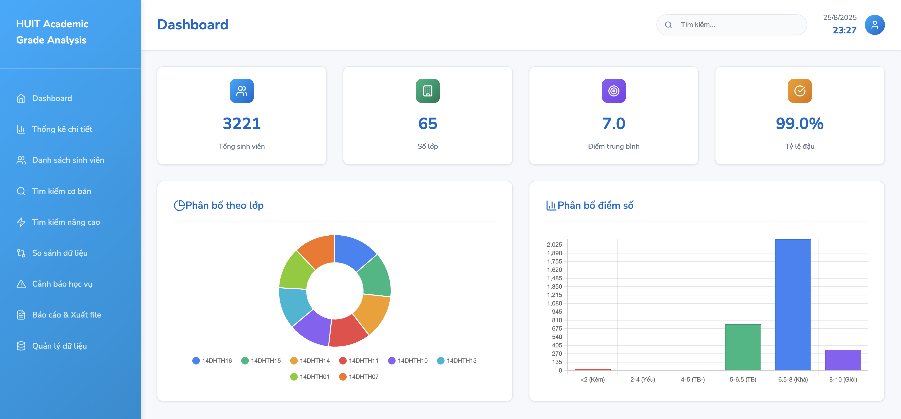

# HUIT Student Management System

## Overview
A modern web-based student management system built with **Flask**, featuring an intuitive interface and powerful functionality:



### ✨ Key Features
- 📊 **Statistical Dashboard**: Comprehensive student data overview with interactive charts
- 🔍 **Advanced Search**: Precise search by student ID, name, class, birth date
- 📁 **Multi-format Import**: Support for CSV, XLSX, TXT files
- 📈 **Detailed Analytics**: Score analysis, grade distribution, pass rates
- 📋 **Data Management**: View and export reports
- 🎯 **Smart Search**: High-precision search algorithms

## System Requirements
- **Python**: 3.8 or higher
- **RAM**: Minimum 2GB (4GB recommended)
- **Storage**: 500MB free space
- **Browser**: Chrome, Firefox, Safari, Edge (latest versions)

## Quick Setup

### 1. Clone repository
```bash
git clone https://github.com/InfinityZero3000/student-management-app.git
cd student-management-app
```

### 2. Create virtual environment (recommended)
```bash
python -m venv .venv
source .venv/bin/activate  # macOS/Linux
# or
.venv\Scripts\activate     # Windows
```

### 3. Install dependencies
```bash
cd flask_app
pip install -r requirements.txt
```

### 4. Launch application
```bash
python server.py
```

🌐 Access: **http://127.0.0.1:5002**

## Project Structure
```
student-management-app/
├── flask_app/                    # Main Flask application
│   ├── server.py                # Main server
│   ├── student_search.py        # Advanced search engine
│   ├── file_processor.py        # File I/O processing
│   ├── requirements.txt         # Dependencies
│   ├── static/                  # Static resources
│   │   ├── css/style.css       # Main stylesheet
│   │   └── js/dashboard.js     # Frontend JavaScript
│   └── templates/              # HTML templates
│       ├── base.html           # Base template
│       ├── dashboard.html      # Dashboard homepage
│       ├── advanced_search.html # Advanced search
│       ├── data_management.html # Data management
│       └── statistics.html     # Statistics
├── data/                       # Sample data
│   └── point.csv               # Student data file (3221 records)
├── .gitignore                  # Git ignore rules
└── README.md                   # This documentation
```

